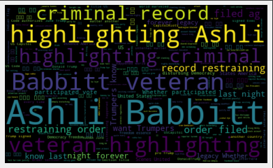
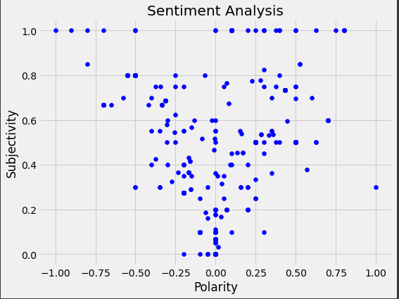
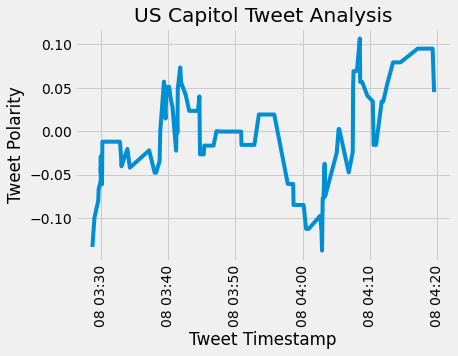
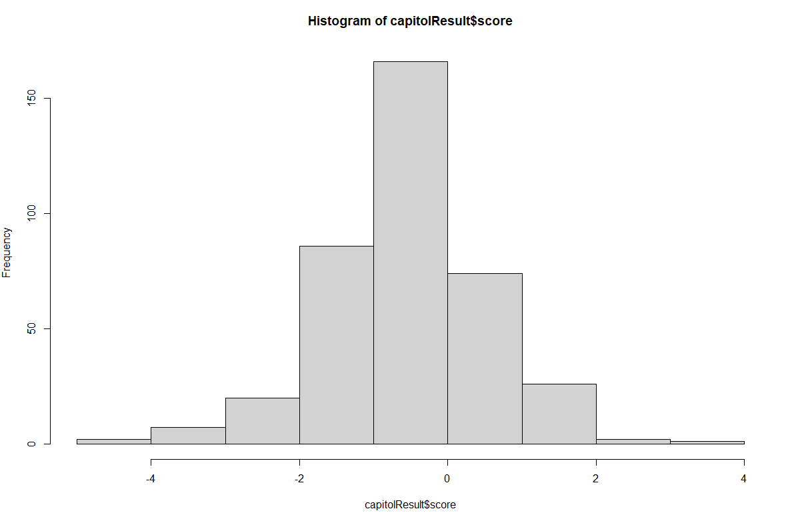
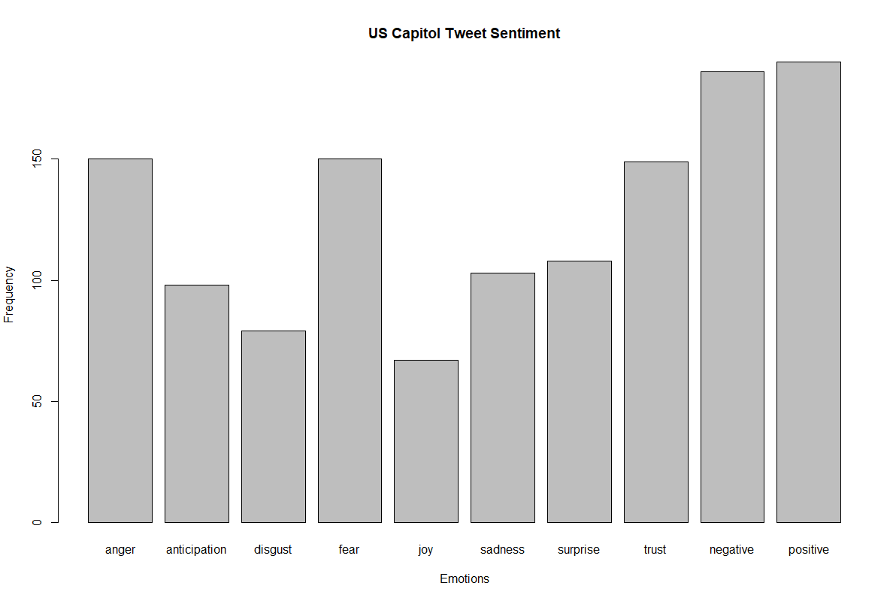
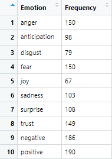

# uscapitol-sentiment-analysis
Sentiment Analysis on Tweets about the "US Capitol"

Yesterday, the US Capitol was breached for the first time since the 19th century. Inspired by my growing interest in NLP, I decided to conduct a sentiment analysis to gauge public opinion regarding the events of this week. I used both Python and R for this analysis, and included information on tweet Polarity, Subjectivity, Term Prevalence, and Emotions.

Soon, I hope to update this analysis by adding information on most frequently associated words in the tweets by looking at some bigrams and n-grams.

-------------------------------
# Word Cloud
I began my analysis in Python using Google Colab (my preferred IDE), and started by accessing the Twitter API, collecting the tweets, cleaning their contents, and calculating their Polarity and Subjectivity values. 

My first visual involved generating a word cloud, shown here:

We can see the "words", in this case names "Ashli" and "Babbitt" are displayed boldly among the terms. I will admit that I did not know who this was and had never heard the name until it was generated by my word cloud. Upon searching the name, I found that she was the lone right-wing extremist killed in the events of January 6th on Capitol Hill.

-------------------------------
# Scatterplot
As mentioned earlier, I had generated the Polarity and Subjectivity values for the tweets collected. I thought that a cool way to visualize these might be to render a scatterplot, using Polarity as the x-axis and Subjectivity as the y-axis:

The result, I thought, was something super interesting to see. There seems to be a fairly even distribution in terms of Polarity, but the Subjectivity displays what almost looks like a funnel. That is, many of the points are located in the upper part of the grid and gradually taper off towards zero - 1 meaning super opinionated, 0 meaning completely objective language. This also suggests that the more opinionated people are (one way or the other), the more subjective their language.

Essentially, this is telling us the obvious - people generally have very strong opinions around Capitol Hill being invaded.

-------------------------------
# Line Chart

Finally, for my analysis in Python, I decided to generate a line chart showing changes in tweet Polarity over time. I did this by collecting the tweet's timestamps and using the dataframe that I'd already created for Polarity:

The results here are really contingent upon how long it took for Twitter users to write 1000 tweets, but we can see that in a span of 50 seconds, sentiment was quite volatile, as people from all walks of life occupy Twitter accounts. 🤷‍♂️

-------------------------------

# ...continuing the analysis in R.

I continued my analysis in R mostly out of frustration/laziness. I spent too much time looking for a Python equivalent of the 'syuzhet' package which I'd already used many times in R, and ultimately decided to continue in RStudio.

-------------------------------
# Histogram

This took a while to create. First I had to set my working directory, access the Twitter API again, clean the tweets, and upload a few .txt files that served as my positive and negative word lexicons. I used a function to apply these lexicons to the cleaned tweets and was able to generate raw sentiment scores for each of them. Here's what the distribution looks like:

We can see that the distribution is very similar to what we saw earlier using Python. Many tweets are more neutral, and apart from that, the positive and negative distributions are fairly even. Different people from different backgrounds with different narratives.

-------------------------------
# Bar Chart

Finally, this is what we've all waited for and the main reason I migrated my efforts to R. Besides the Polarities, I wanted to see that kind of emotions could be identified in the tweets I had collected. Sure, people usually feel positive or negative about things, but there are always nuances. I needed a package I had relied upon for previous analyses, so I dusted off my RStudio instance and fired up the 'syuzhet' library. Here's what it gave me:

If you're struggling to see whether anger or fear take first prize, here's some help:

Note that the polarities (positive and negative) are separate from the actual emotions. 

We can see that fear and anger max out as the top sentiments here, followed by trust(?), and then surprise. This isn't too surprising given what occurred yesterday as unprecedented division and inflammatory rhetoric came to a head.

-------------------------------
Overall, I really enjoyed learning more about how people feel about what happened at the US Capitol building yesterday. I definitely did not do this alone and relied mostly on other scripts and several YouTube videos to help get me to this point, but I really don't feel like this analysis is quite complete. 

I'd love to look at some bigrams and n-grams for at least 1000 tweets as well to explore the most closely associated terms. Until then though, I hope you enjoyed and found value in my analysis.
